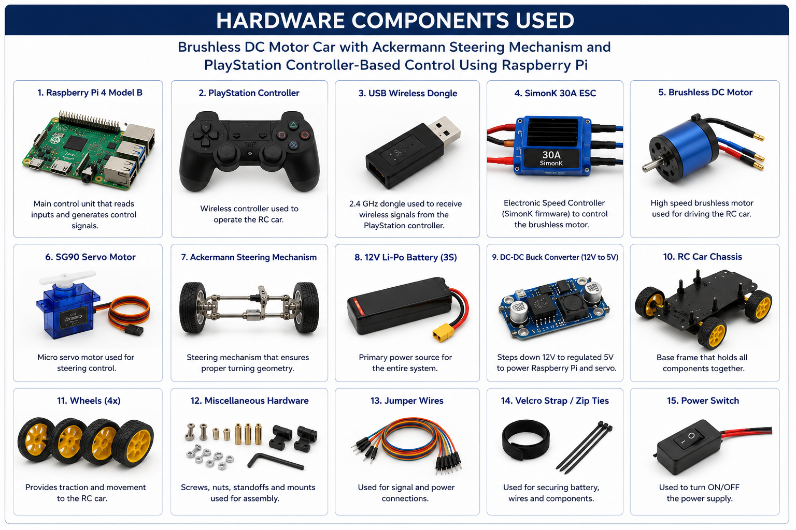
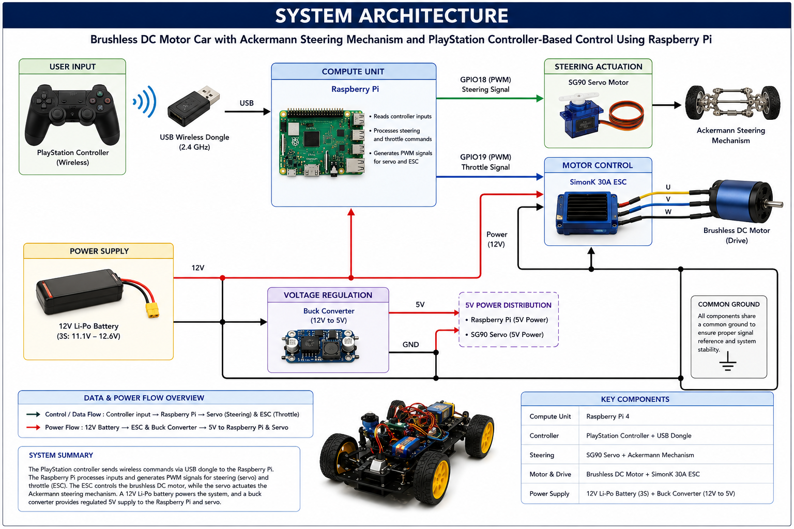
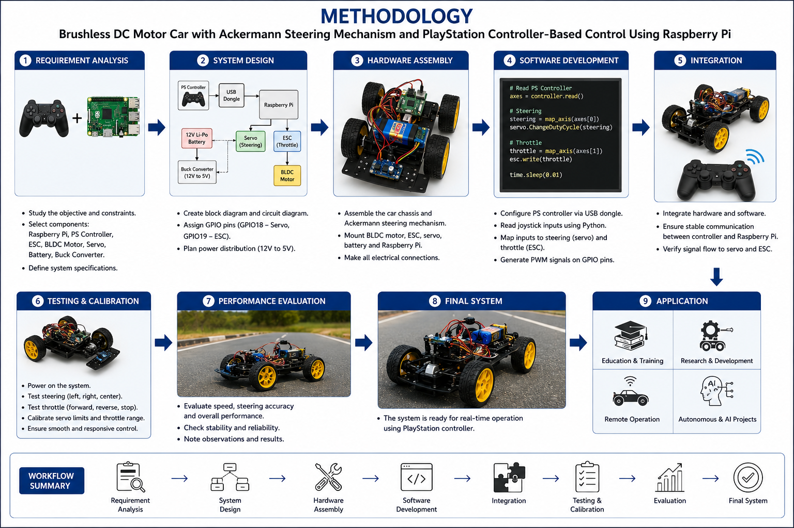
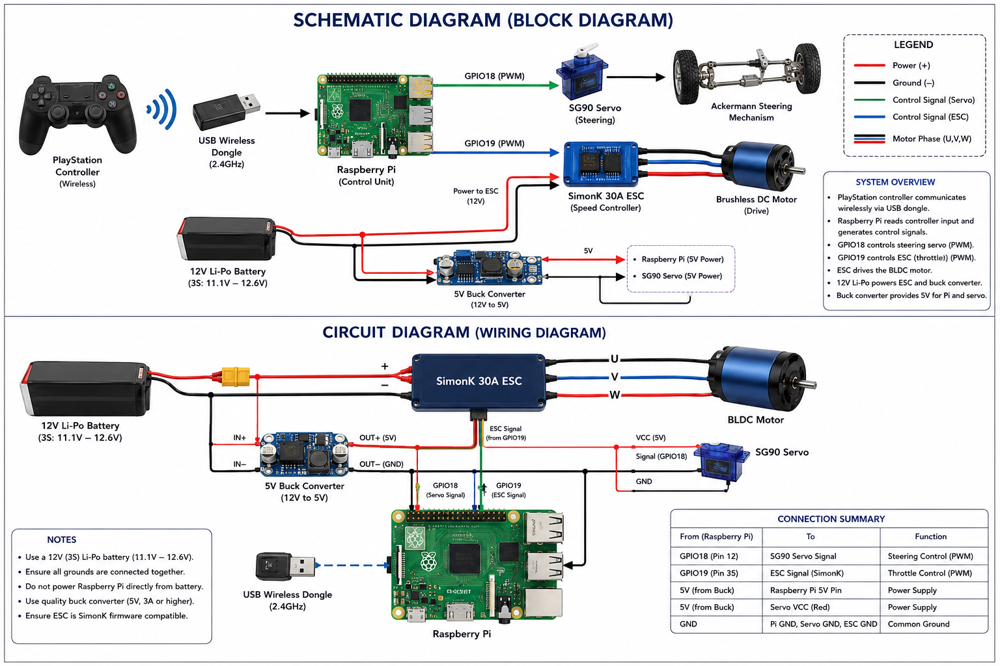

# Rc-Car
Rc car
# 🚗 Brushless DC Motor RC Car with Ackermann Steering and Raspberry Pi Control

## Overview

This project presents the design and development of a remote-controlled (RC) car powered by a Brushless DC (BLDC) motor and controlled wirelessly using a joystick. A Raspberry Pi serves as the central processing unit, receiving joystick inputs and generating control signals for both steering and throttle.

The vehicle incorporates an Ackermann steering mechanism, which improves turning efficiency by ensuring the front wheels follow appropriate steering angles during cornering. The project combines embedded systems, motor control, wireless communication, and vehicle dynamics into a practical platform suitable for robotics and autonomous vehicle research.

---

## Features

- Wireless joystick control
- Raspberry Pi-based vehicle control
- BLDC motor propulsion
- Ackermann steering mechanism
- SG90 servo-based steering system
- Smooth throttle ramping
- Real-time response to user inputs
- Compact and modular design
- Expandable for autonomous vehicle applications

---

## Hardware Components

| Component | Purpose |
|------------|------------|
| Raspberry Pi | Main controller |
| BLDC Motor | Vehicle propulsion |
| SimonK 30A ESC | Motor speed control |
| SG90 Servo Motor | Steering control |
| Wireless Game Controller | User input |
| USB Wireless Receiver | Communication with Raspberry Pi |
| 12V LiPo Battery | Power supply |
| Ackermann Steering Assembly | Steering mechanism |
| RC Car Chassis | Vehicle platform |

---

## System Architecture

```text
Wireless Controller
        │
        ▼
USB Wireless Receiver
        │
        ▼
   Raspberry Pi
      │     │
      │     │
      ▼     ▼
   Servo    ESC
      │      │
      ▼      ▼
Steering  BLDC Motor
             │
             ▼
         Rear Wheels
```

---

## Software Requirements

- Raspberry Pi OS
- Python 3
- Pygame
- Evdev
- RPi.GPIO

### Install Dependencies

```bash
pip install pygame evdev
```

---

## Working Principle

1. The wireless controller sends steering and throttle inputs.
2. The USB receiver connected to the Raspberry Pi receives these inputs.
3. Steering commands are converted into servo motor positions.
4. Throttle commands are translated into ESC control signals.
5. The ESC regulates the speed of the BLDC motor.
6. The Ackermann steering linkage translates servo motion into wheel steering angles.
7. The vehicle responds in real time to user inputs.

---

## Steering Control

The steering subsystem includes:

- SG90 servo motor
- PWM control through GPIO18
- Dead-zone filtering
- Incremental steering adjustments
- Ackermann steering geometry

These features help reduce steering jitter and improve handling performance.

---

## Throttle Control

The throttle subsystem includes:

- SimonK 30A ESC
- PWM control through GPIO19
- Smooth acceleration ramping
- Controller-based braking
- Configurable motor direction

These features provide smoother acceleration and better vehicle control.

---

## Project Structure

```text
RC-Car/
│
├── README.md
├── rc_car_control.py
├── images/
│   ├── hardware_setup.png
│   ├── system_architecture.png
│   ├── methodology.png
│   └── circuit_diagram.png
│
├── reports/
│   ├── internship_report.pdf
│   └── project_report.pdf
│
└── videos/
    └── demonstration.mp4
```

---

## Applications

- Robotics projects
- Embedded systems learning
- Remote-controlled vehicle development
- Autonomous vehicle prototyping
- Vehicle dynamics research
- Computer vision experimentation

---

## Future Enhancements

- First-person view (FPV) camera
- Autonomous navigation
- Obstacle detection and avoidance
- GPS-based waypoint tracking
- Computer vision integration
- Machine learning-assisted driving
- Mobile application control

---

## Results

The developed RC car successfully demonstrates:

- Smooth BLDC motor control
- Responsive Ackermann steering
- Reliable wireless operation
- Real-time vehicle control
- A scalable platform for future autonomous vehicle research

---

## Images

### Hardware Components



### System Architecture



### Methodology



### Circuit Diagram



---

## Author

**Varun Bhandary**

Bachelor of Engineering (Robotics and Automation Engineering)

Project Title: **Brushless DC Motor RC Car with Ackermann Steering and Wireless Joystick Control using Raspberry Pi**

---

## License

This project is released for educational and research purposes. Feel free to use, modify, and improve the design for your own applications.